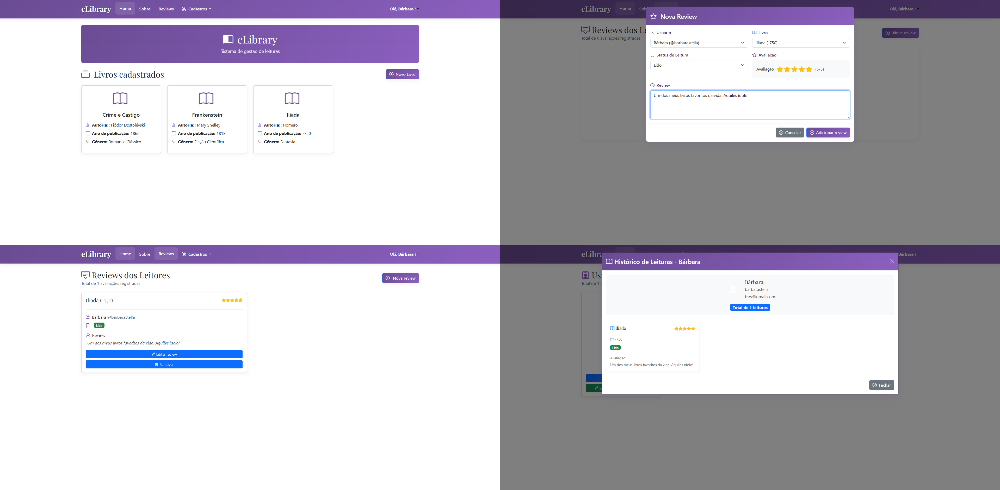

# eLibrary Web


Interface front-end desenvolvida em React, em formato PWA (Progressive Web App), para catalogação e gerenciamento de livros, autores, gêneros e leituras, incluindo resenhas e status.

> **Status de hospedagem**: Esta aplicação foi originalmente implementada em produção utilizando a plataforma [Vercel](https://vercel.com/docs), pela URL [**pw-elibrary.vercel.app**](https://pw-elibrary.vercel.app/). Atualmente, encontra-se inutilizável devido a limitações de infraestrutura gratuita de hospedagem da API, mas o projeto está funcional para execução e testes em ambiente local.

<p align="center">
<mark>&nbsp;<b>Observação</b>: Este projeto foi projetado exclusivamente para consumir a API disponível no repositório público <a href="https://github.com/barbarastella/elibrary-backend"><b>barbarastella/elibrary-backend</b></a>, em que foi desenvolvida a integração com banco de dados, as regras de negócio e a validação dos tokens JWT.&nbsp;</mark>
</p>



## 🔴 Funcionalidades

- Implementação de Role-Based Access Control (RBAC), onde ações destrutivas (ex: editar e remover livros, autores, usuários) são renderizadas apenas para usuários definidos como `admin`, enquanto usuários regulares podem interagir livremente com suas próprias reviews;

- Operações de CRUD completas utilizando modais interativos e formulários validados, evitando recarregamentos de página desnecessários;

- Componentes customizados para avaliação de livros por estrelas (1 a 5) e exibição do progresso de leitura (Lido, Lendo, Quero ler);

- Implementação de estados de loading e alertas para informar ao usuário o status das requisições assíncronas em tempo real.

## 🟠 Arquitetura

- Utilização do [React Router Dom](https://reactrouter.com/home) para separar o layout público (`/`) do layout privado do painel (`/admin`);

- Interceptador `WithAuth.jsx` que verifica a existência e a validade (data de expiração) do token JWT no `localStorage` utilizando a biblioteca `jwt-decode`, bloqueando a rota e forçando redirecionamento para login caso o token seja inválido;

- Padronização do consumo da API REST isolando as chamadas HTTP em arquivos de serviço e recuperando/injetindo o token JWT automaticamente nos Headers através da função `getToken()`;

- Uso intenso de componentes de UI ([Bootstrap 5](https://getbootstrap.com/docs/5.0/getting-started/introduction/)) padronizados e reutilizáveis, mantendo a consistência visual em todo o sistema.

## 🟡 Execução

**Pré-requisitos:** ter o Node.js e o Yarn instalados e o back-end ([eLibrary API](https://github.com/barbarastella/elibrary-backend)) rodando em paralelo.

```bash
# Clone o repositório
git clone https://github.com/barbarastella/elibrary-web.git

# Acesse a pasta do projeto
cd elibrary-web

# Instale as dependências utilizando o Yarn
yarn install

# Configure as seguintes variáveis de ambiente baseadas no .env.example
# REACT_APP_ENDERECO_API: endereço da API (local ou produção)

# Inicie a aplicação
yarn start
```

## 🔵 Contato

<p align="left">
  Em caso de dúvidas ou comentários, entre em contato:&nbsp;
  
  <a href="https://www.linkedin.com/in/barbara-wehrmann/" title="LinkedIn">
    
  </a>
  <a href="mailto:barbarastellaw@gmail.com" title="Gmail">
    
  </a>
  <a href="https://www.instagram.com/barbarastellaw" title="Instagram">
    
  </a>
</p>
